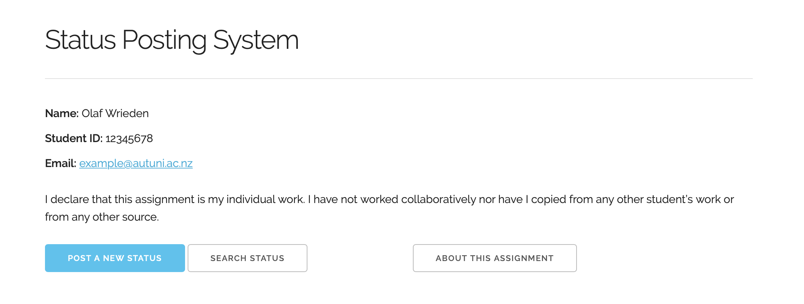

# PHP Status Posting System (Web Development Assignment 1)

> The aim of this assignment is to create a status system for a social networking site. This system will allow users to post their status and save it to a database table. These posted status details can also be retrieved using text matching.



## Introduction

Following an introduction to PHP, in this assignment I built a very simple PHP / HTML system where a user enters the details of their fictitious status update (including status code, message, date of publication, share, and permission type). This data is validated and stored in a MySQL database by the server-side PHP scripts.

A user is warned about duplicate status codes, failed submissions etc. This system uses [Skeleton CSS](http://getskeleton.com) - a simple and responsive boilerplate. Overall, this assignment received full (100/100) marks as it met all required criteria.

## Getting up and running

### Connecting to a Relational Database

1. Navigate to [poststatusprocess.php](/poststatusprocess.php#L79) (Line #79) and replace the database credentials placeholders with your MySQL connection details.
   ```php
   // Database Credentials
   $servername = "[YOUR_DB_SERVER_STRING]";
   $username = "[YOUR_DB_USERNAME]";
   $password = "[YOUR_DB_PASSWORD]";
   $dbname = "[YOUR_DB_NAME]";
   ```
2. Navigate to [searchstatusprocess.php](/searchstatusprocess.php#L39) (Line #39) and replace the database credentials in this file too. **Note:** The assignment did not permit for an additional `settings.php` file to consolidate the database details and `require_once('./settings.php');` where needed.
3. Upload these files to your PHP environment or install a PHP Server extension in your IDE to serve the project locally.
4. Simply post a new status. As the database table `posts` does not yet exist, the PHP script will firstly create this table, then proceed to insert the post (provided it meets all criteria). **Note:** *Status Code* follows the format `S0000` (an **S** followed by four digits).

## Screenshots

|      Post Status      |     Success Message      |
| :-------------------: | :----------------------: |
|  |  |

|      Search Status      |       Show Search Result       |
| :---------------------: | :----------------------------: |
|  |  |

|     Showing Multiple Results      |      About Screen      |
| :-------------------------------: | :--------------------: |
|  |  |

### Example Rows in Database


### Table Structure


